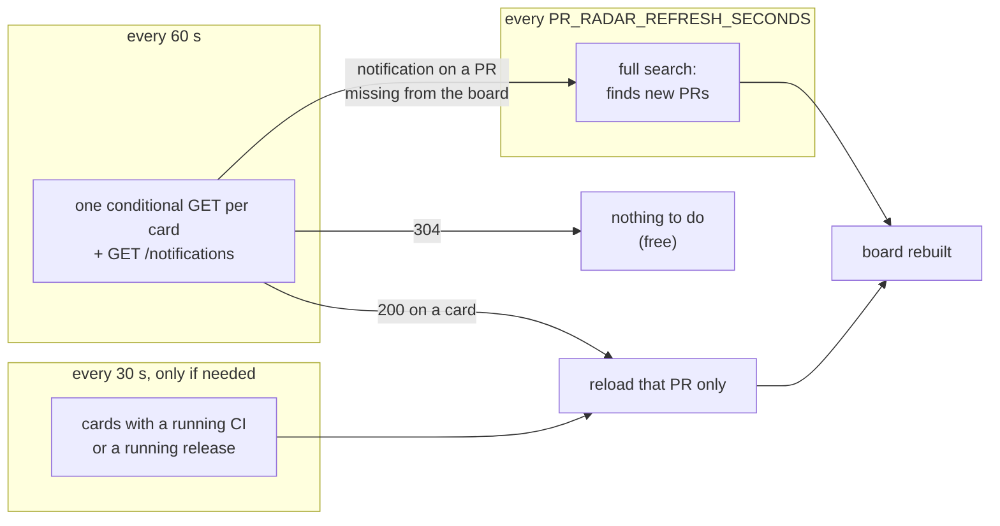
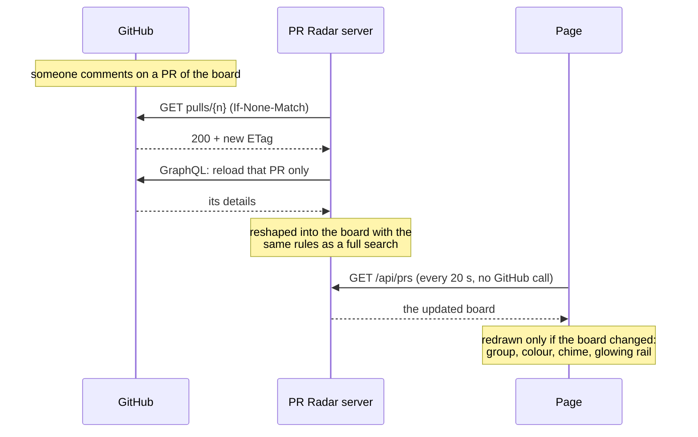

# Live refresh

How PR Radar shows a change within about a minute instead of five, without asking GitHub
for more. The settings and the guards are summed up in the README,
[How fresh the board is](../README.md#how-fresh-the-board-is); this page explains the
mechanism.

## The problem

The board used to redo everything every `PR_RADAR_REFRESH_SECONDS` (300 s), whether anything
had happened or not:
- eight GitHub searches;
- the event feed;
- every PR's details.

Two problems came out of this:
- A change took up to five minutes to show.
- Every hour cost the same, about 22 to 24 calls per refresh. Most of them were searches,
  the scarce quota: 30 a minute, and a secondary rate limit already hit once.

Webhooks would fix the delay, but they need an org admin to set up, and would send the
private repos' activity to a server. Everything here stays local and goes through the user's
own `gh`.

## The idea: ask, for free, whether anything changed

GitHub supports conditional requests:
- **The PR itself.** `GET /repos/{owner}/{repo}/pulls/{n}` sent with the `ETag` of the last
  answer (`If-None-Match`) returns `304 Not Modified` when the PR has not changed.
- **The notifications.** `GET /notifications` sent with `If-Modified-Since` returns `304` the
  same way.

A `304` does not count against the rate limit. So the board can ask every card "have you
changed?" every minute, at no cost while nothing happens, and reload only the cards that
answer yes.

## Three cadences

| Cadence | Why it exists |
| --- | --- |
| **Checks, every 60 s** | Catch any human change on a card already on the board: a comment, a review, a push, a merge. `60` is also the floor `/notifications` sets through `X-Poll-Interval`. |
| **In flight, every 30 s** | A running CI or release changes state with no human event. A PR's `ETag` does not move when its checks finish, so these cards have their **status only** read directly, for 30 minutes at most each, and are reloaded in full once it moves. |
| **Full search** | The only way to discover a **new** PR, such as one just opened or a review just requested. A notification about a PR missing from the board brings it forward, but never sooner than 90 s after the previous one. |

## The path of a change

Two shortcuts make your own moves show at once:
- **A PR made or opened in a Claude session.** It is read from the same transcripts as the
  Claude session button, when that feature is on.
- **A return to the tab after a minute away**, most likely from GitHub itself. It asks for a
  check right away.

## Reshaping a reloaded PR into the board

A reloaded PR has to land exactly where a full search would have put it: its side (mine or
review), its group and its pills. `github.js` splits the work in three:
- `discover()` runs the searches and keeps what they told: who I am, which source found each
  PR (review requested, assigned, merged and reviewed by me…), and the time windows.
- `loadNodes()` loads PR details.
- `shapeBoard()` is pure. It builds the board from the loaded PRs and the discovery context,
  and starts from copies of the context's sets every time. So a PR moved by the taken-over
  rule goes back to the review side once its author pushes, even between two searches.

A full search is `discover` + `loadNodes` + `shapeBoard`. A partial reload replaces a few PRs
in the stored set and calls `shapeBoard` again. A PR the reload does not return is kept as it
was: a lost batch is not a closed PR, and the next full search settles it.

## What it costs

Measured behind a `gh` that logs every call, on a real board, a tab open. The counted calls are
the ones that spend the API quota; a `304` does not.

| Setup | Counted per hour | of which searches | Free `304` per hour | Time to see a change |
| --- | --- | --- | --- | --- |
| Before: everything every 5 min (Oct 5, 11h–12h) | ~290 | ~80 | ~10 | up to 5 min |
| Live refresh, without the savings below (Oct 5, 15h–17h) | ~400 | ~80 | ~190 | ~1 min |
| Live refresh, as it stands (Oct 6, 9h–12h) | ~295 | ~85 | ~230 | ~1 min |

A full search costs about 12 calls, against about 24 before PRs were reused (measured
overnight, with nothing else running).

- **The searches are now the main cost**: about 12 full searches an hour, of 7 search calls
  each, the same in every setup. Spacing them from 5 to 10 minutes would save about 40 calls
  an hour. PRs already on the board stay just as fresh; only a brand-new one waits longer. A
  review request I add myself sends me no notification, so it waits for the next full search.
- **Targeted reloads grow with activity**, one PR at a time, and a CI in flight is read every
  30 s. The Oct 6 morning included a release run re-run after a flaky test.

## Guards

| Situation | What happens |
| --- | --- |
| A burst of notifications | At most one full search brought forward, 90 s after the previous one at the earliest |
| A CI stuck in a queue | Followed for 30 minutes, then left to the regular cadence |
| A reload fails | The card reads as changed on the next round, so the change is not lost |
| The tab is hidden | Checks every 5 minutes |
| No page for 10 minutes | No GitHub call at all; the next page opened runs a full search |
| A note being edited | The page redraws only when the board changed, so the editor stays open |
| `gh` exits 1 on a `304` | Read as an answer, not an error (`watch.js`, `parseResponse`) |
| A check genuinely fails | Logged on the server; the full search stays the safety net |

## Settings

| Variable | Default | |
| --- | --- | --- |
| `PR_RADAR_CHECK_SECONDS` | `60` | Free checks between two full searches. `0` goes back to a full refresh every `PR_RADAR_REFRESH_SECONDS` and nothing else. |
| `PR_RADAR_REFRESH_SECONDS` | `300` | Full search interval. |

## Code map

- **`watch.js`**:
  - `createWatcher` holds the `ETag`s and the notifications' `Last-Modified`;
  - `inFlight` and `toFollow` pick the cards to follow;
  - `nextDiscoveryAt` enforces the gap between full searches.
- **`github.js`**:
  - `discover`, `loadNodes`, `shapeBoard`, `fetchBoard` (with the PRs it may reuse);
  - `STATUS_QUERY`, `statusFingerprint`, `fetchStatusFingerprints` for the cards in flight;
  - the event feed's conditional first page in `recentlyTouchedPullRequests`.
- **`server.js`**:
  - `patchPrs` reloads a few PRs into the cached board;
  - `reusableNodes` picks what a scheduled search may reuse (`REUSE_MS`);
  - `liveStep` and `liveTick` run the loop;
  - the `/api/prs` route renews the page lease.
- **`claude-sessions.js`**: `scan()` returns the PR links new since the last scan (`touched`).
- **Tests**: `test/watch.test.js`, `test/fetch.test.js` (reuse, status fingerprint, event
  feed), and the reshaping cases in `test/classification.test.js`.
